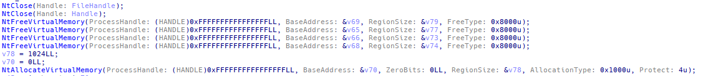
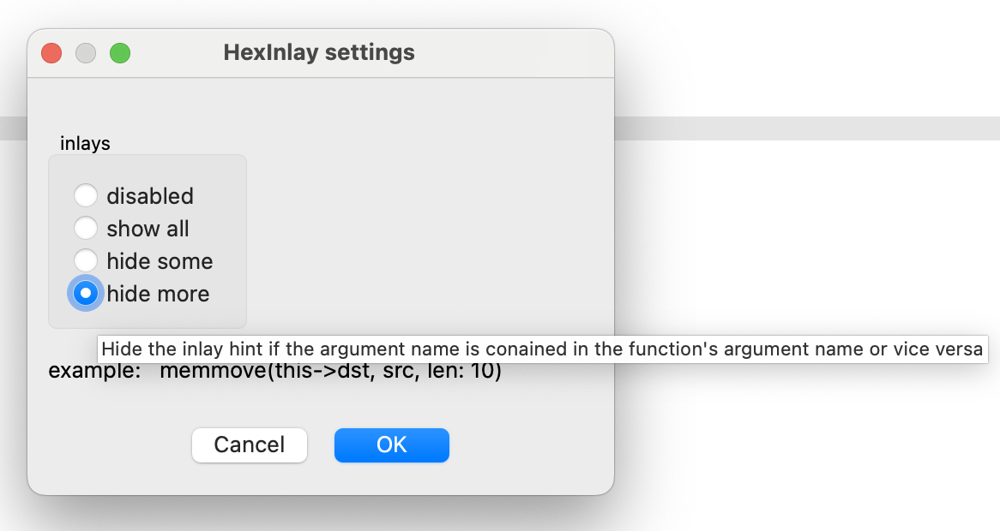

# HexInlay
Inlay hints for hex-rays decompiler

# Settings
You can enable / disable inlay hints in the `Edit` -> `Plugins` -> `HexInlay` menu. You can also choose whether to hide the redundant hints.

## Installation
### Ida 9+
Put the folder [HexInlay](HexInlay) into your ida plugins folder.
### Ida 8.4
Put the file [hexrays_inlay.py](HexInlay/hexrays_inlay.py) into your ida plugins folder.
